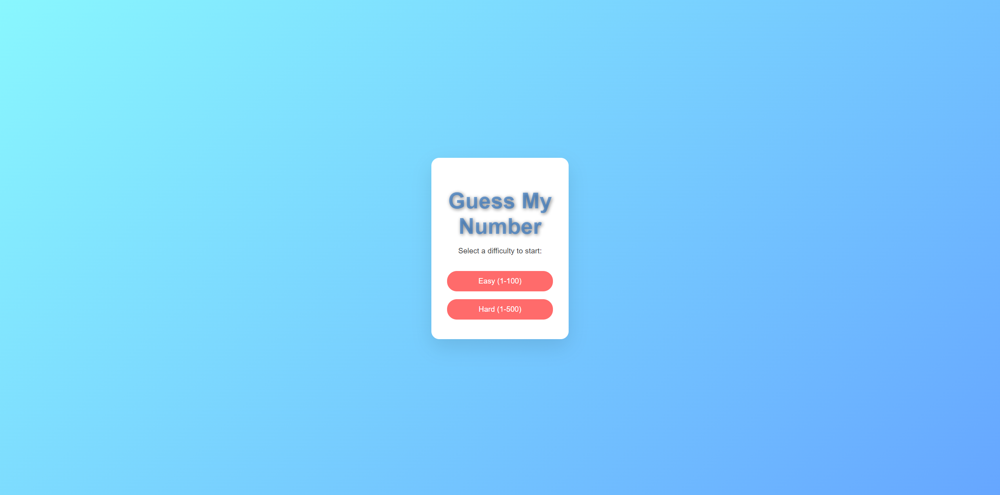
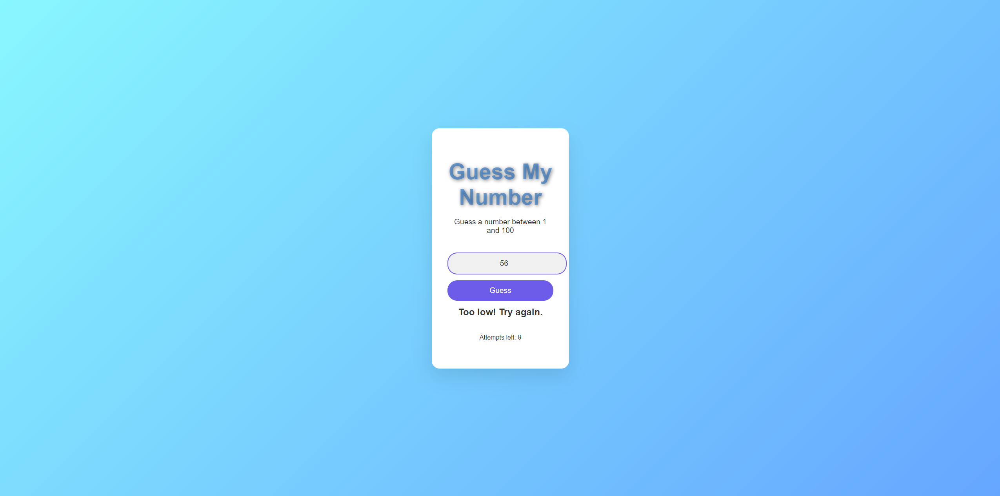
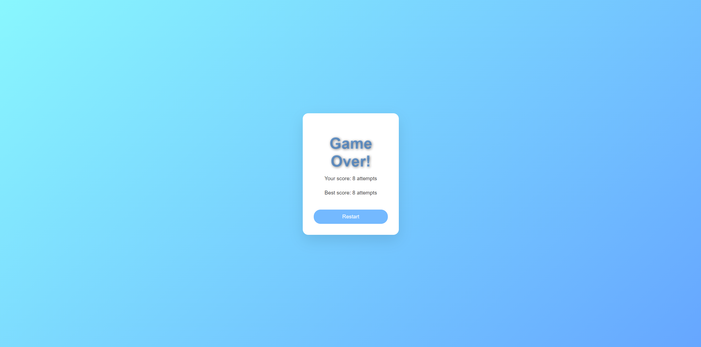

Certainly! Here’s a well-structured `README.md` for your project in English, following a professional format.

### README.md

````markdown
# Guess My Number Game 🎲

"Guess My Number" is an interactive number guessing game built with **HTML**, **CSS**, and **JavaScript**. Players can choose between two difficulty levels and guess a number within the specified range. The game provides feedback after each guess, guiding the player towards the correct number.


## Features 🚀

- **Two difficulty levels**: Easy (1-100) and Hard (1-500)
- Instant feedback on whether the guess is too high or too low
- Remaining attempts counter to track progress
- Responsive design for mobile and desktop screens
- Modern UI with hover effects, animations, and transitions
- Input validation to ensure valid guesses

## Table of Contents 📋

- [Installation](#installation)
- [Usage](#usage)
- [Technologies Used](#technologies-used)
- [Screenshots](#screenshots)
- [Contributing](#contributing)
- [License](#license)

## Installation 🔧

Follow these steps to set up the project locally:

1. **Clone the repository**:
   ```bash
   git clone https://github.com/your-username/guess-my-number.git
   ```
````

2. **Navigate to the project directory**:

   ```bash
   cd guess-my-number
   ```

3. **Open the project in your browser**:
   Simply open the `index.html` file in your browser to start playing.

## Usage 🎮

1. Choose your difficulty level (Easy or Hard).
2. Enter a guess between the specified range and click "Guess".
3. Receive feedback if your guess is too high or too low.
4. Keep guessing until you find the correct number!
5. After the game ends, restart by clicking the "Restart" button.

## Technologies Used 🛠️

- **HTML**: Structure of the game interface
- **CSS**: Styling and layout with modern design techniques
- **JavaScript**: Game logic, interactivity, and feedback system

## Screenshots 📸

### Start Screen:



### Game Screen:



### End Screen:



## Contributing 🤝

Contributions are welcome! Here’s how you can contribute:

1. Fork the repository.
2. Create a new branch (`feature/your-feature-name` or `bugfix/your-bug-name`).
3. Commit your changes and push them to your branch.
4. Open a pull request.

Feel free to suggest new features or enhancements!

## License 📄

This project is licensed under the MIT License. See the [LICENSE](LICENSE) file for details.

---

Created with ❤️ by [Aytekin Kaplan](https://github.com/aytekinkaplan)

```

### Key Points in the README:
1. **Project Overview**: Provides a brief description of what the game does, along with a screenshot.
2. **Features Section**: Lists the main features of the game, making it clear what functionalities are provided.
3. **Installation Instructions**: Clearly outlines how to clone the repository, navigate to the directory, and run the game.
4. **Usage Section**: Simple steps explaining how to play the game.
5. **Technologies Used**: Describes the technologies used to build the game (HTML, CSS, JavaScript).
6. **Screenshots Section**: Displays screenshots of different stages of the game (start screen, gameplay, end screen).
7. **Contribution Guidelines**: Instructions on how others can contribute to the project.
8. **License Information**: States the license under which the project is distributed.
```
